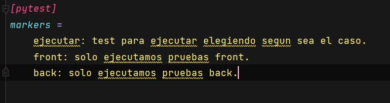

# Framework de Pytest-Selenium 🐍 🚀🛸 


> #### Requiriments.txt ‍💻
>
> -  Instalar con pip
> 

## IDE Pycharm 


> #### Comandos 👨 🏻 ‍💻
>
> - pytest nombreArchivo.py
> - pytest --collect-only ----> Para correr los archivos que empiecen con "test_" dentro del proyecto.
> - pytest -k 'test_first_url' --collect-only ----> Corremos solo el mark para esa funcion.
> - pytest -k asdict or defaults' --collect-only ----> Ejecuta solamente lo que le enviamos por parametro para elegir las funciones de test.
> - pytest -v -m ejecutar ----> ejecutamos test por tags, si no son tags de pytest y son propias de nuestro sistema, personalizadas guardar en el pytest.ini.
> - @pytest.mark.skip(reason='razon por la que hacemos skip a ese test') -----> Para hacer skip de algun test solo le agreagamos la marca.
> - @pytest.mark.xfail(reason='falla porque necesitamos probar el xFail()') -----> Lo mismo podemos hacer para que un test falle porque necesitamos eso particular para alguna prueba. 
> 

## IMGS de referencia



## Reporte
> ```
> Generamos reportes con el siguiente comando, por el momento solo generamos de los test que encuentra en el archivo que le indicamos 💾
> pytest test_webElements.py --html=ReporteTests.html ----> En este archivo solo existe un test de front 
> ```


> #### Archivos 💾
>
> - Para que ejecute los test y asi mismo pytest pueda identificar el tag/mark el archivo debe tener un nombre valido.
> - ejemplo test_elementofront.py; test_frontventa.py; test_backventa.py.
> 